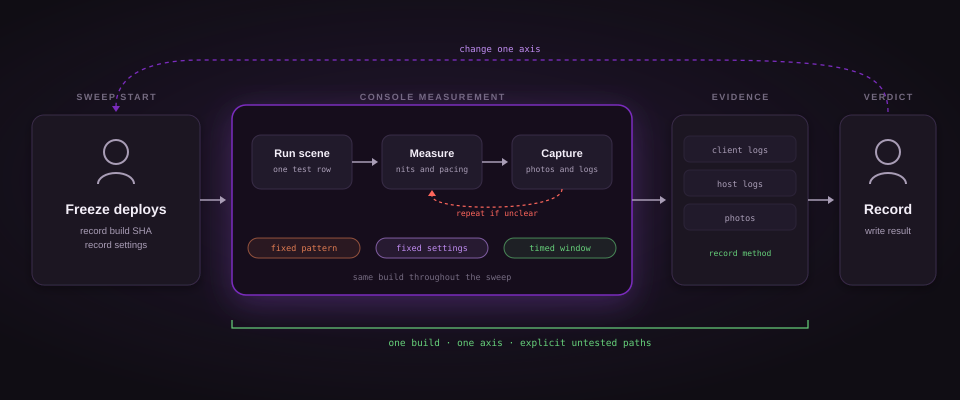

# Moonlight Xbox+ console test sweep runbook

The owner's step-by-step procedure for a manual console test sweep: it turns the PLAN section 14 matrix into runs that each end in one complete `docs/TEST-RESULTS.md` entry (PLAN 14.2).

- PLAN section references explain the experiment. Helper scripts and the current workflow define exact commands; recovered line numbers are historical and may have moved. Nothing here is a measurement.
- Pending comparisons use the instrumented control at `22086e9`, package `1.18.19.0`, CI run `34979936943`. Its local deployment summary records a credential-gated skip, so install and verify it before measuring. Keep the same instrumentation in each treatment.
- Shell for every command: PowerShell 7 (`xbox-deploy.ps1`; `-SkipCertificateCheck` needs it, PLAN 3.13).
- Never print, paste, or commit anything from `C:\Users\ygordreyer\.xbox-deploy\` (PLAN 16 rule 20; PLAN 7.5). Naming the path is fine.



## 1. Preconditions

- [ ] Gate 1 is closed: `C:\Users\ygordreyer\.xbox-deploy\credentials.json` exists and carries all three of `consoleAddress`, `username`, `password` (PLAN 17 Gate 1; `xbox-deploy.ps1` throws when one is missing). Check presence only.

```powershell
Test-Path C:\Users\ygordreyer\.xbox-deploy\credentials.json   # expect True; never Get-Content this file (PLAN 16 rule 20)
```

- [ ] `consoleAddress` in that file is the full portal base URL `https://192.168.18.20:11443` (PLAN 3.11), matching the helper's request-base format.
- [ ] The runner is online (PLAN 7.2):

```powershell
gh api repos/ygordreyer/moonlight-xbox-plus/actions/runners --jq '.runners[] | select(.name=="ygor-desktop-xbox-lan") | .status'   # expect online
```

- [ ] The deploy job of the build under test finished with `success: true`, `launched: true`, `packageFullName` set, and no `skipped` key (`xbox-deploy.ps1` soft-skip, `:649-650`, `:658`, `:673`). A summary with `skipped: true` means the console does not have the build; the sweep cannot start.

- Local results live under `C:\moonlight-ci\handoff\<run_id>-<run_attempt>`. Preserve the whole run directory outside retention before a sweep.
- Read `build-info.json` for SHA, ref, runNumber and version. Read its saved `deploy-out/deploy-summary.json` for installation status.
- GitHub artifacts exist only if the dispatch explicitly enabled uploads. Do not use `gh run download` as the default local-CI path.
- Record CI run ID, attempt and run number separately from this sweep's measurement ordinal.

- [ ] Cross-check on the console: the installed package version is `<major>.<minor>.<run_number>.0` (`msbuild.yml`; PLAN 6.1 step 3), so `Version.Build` from `GET /api/app/packagemanager/packages` (PLAN 3.12) and the version inside `packageFullName` in `deploy-summary.json` (`xbox-deploy.ps1`) must equal `runNumber` in `build-info.json`. The helper block in 3.0 prints it.
- [ ] Sweep freeze is announced (PLAN 16 rule 33): nothing pushes to the deployed branch until the sweep ends. Every push to `main`, `experiment/**`, `feature/**`, or `ci/**` triggers a deploy (`msbuild.yml`, `:351-354`) that replaces the one installed package `50497EliaZammuto.MoonlightUWP` (`xbox-deploy.ps1`), so the freeze covers every deploying branch and every `workflow_dispatch` with `deploy=true`, not only the branch under test. Tell every live agent session before the first run.
- [ ] `docs/TEST-RESULTS.md` exists on the branch under test, or this sweep's first entry creates it; append, never rewrite (PLAN 5 layout additions; PLAN 14.2).
- [ ] No portal re-probe "to check credentials" (PLAN 16 rule 26); the deploy summary is the check.

## 2. Console settings to record before every run

Copy these lines into the entry (section 4). Exactly one of them changes between consecutive runs (PLAN 14.1).

- [ ] Title resource mode: `App` or `Game` (Dev Home per-title setting, PLAN 3.19; PLAN 8 Phase 2c). The standard sweep runs in Game (PLAN 14.1).
- [ ] Dev Home "Treat UWP apps as games by default": `on` or `off` (PLAN 3.19; PLAN 8 Phase 2c).
- [ ] Dev Home Settings, Display Settings, "Allow Variable Refresh Rate (VRR)": `on` or `off` (PLAN 3.19; PLAN 8 Phase 2d; PLAN 16 rule 27).
- [ ] TV: HDR `on` or `off`, VRR `on` or `off`, picture mode unchanged from the previous run (PLAN 16 rule 8: the TV is never the fix, so it is a constant to record; PLAN 14.4 reads the TV's own refresh readout).
- [ ] Host: Windows HDR on the captured display `ZakoHDR` (PLAN 3.11) `on` or `off`; `hdrBrightnessMode` manual `1000` (normal) or manual `1690` (the one diagnostic run, PLAN 12).
- [ ] Host stream settings for the row: codec, resolution, fps, HDR on or off (PLAN 14.1 axes).
- [ ] Quick menu state planned for the measurement: `closed` or `open` (PLAN 14.1; the menu is the XAML `MenuFlyout`, PLAN 3.7).

## 3. Per-run procedure

### 3.0 Helper block, once per sweep

Mirrors the script's own credential handling (`xbox-deploy.ps1`, `:267-279`): the file is read into a `PSCredential`, never printed. GET calls need no CSRF header: it applies to non-GET requests only, and an `auto-` username is exempt anyway (PLAN 7.3 step 5; PLAN 17 Gate 1 step 2).

```powershell
# PowerShell 7. Never print $raw, $cred, or the credentials file (PLAN 16 rule 20; PLAN 7.5).
$raw  = Get-Content -LiteralPath "C:\Users\ygordreyer\.xbox-deploy\credentials.json" -Raw | ConvertFrom-Json   # xbox-deploy.ps1:221
$base = $raw.consoleAddress.TrimEnd('/')                                                                         # xbox-deploy.ps1:244
$cred = [pscredential]::new($raw.username, (ConvertTo-SecureString -String $raw.password -AsPlainText -Force))   # xbox-deploy.ps1:236, :268
Remove-Variable raw
function Get-Wdp([string]$Path) { Invoke-RestMethod -Uri "$base$Path" -Credential $cred -Authentication Basic -SkipCertificateCheck -TimeoutSec 30 }   # xbox-deploy.ps1:270-279
$pkg = (Get-Wdp '/api/app/packagemanager/packages').InstalledPackages | Where-Object { $_.Name -eq '50497EliaZammuto.MoonlightUWP' } | Select-Object -First 1   # xbox-deploy.ps1:440-452; PLAN 3.12
$pfn = $pkg.PackageFullName; $runNumber = $pkg.Version.Build   # version <major>.<minor>.<run_number>.0 (msbuild.yml:121-122)
"$pfn  run_number=$runNumber"
$runDir = Join-Path $HOME "moonlight-runs\run-$runNumber"; New-Item -ItemType Directory -Force -Path $runDir | Out-Null   # runbook convention for photos and pulled logs, not in PLAN
```

### 3.1 The rows

The standard sweep per experiment branch is rows A, B, C (PLAN 14.1). Extra rows run only when a result is ambiguous (PLAN 14.1) or the branch's own `docs/experiments/<name>.md` names the axis (PLAN 5 branch rules). Every row: Game mode, Dev Home VRR as recorded in section 2, one axis changed from the previous row.

| Row | Stream | Quick menu | Scene on the host | Observe | Measure | Source |
|---|---|---|---|---|---|---|
| A | HEVC Main10 HDR, 4K60, HDR on | closed | • Same HDR test pattern with nit-labelled steps every run<br>• PLAN fixes no pattern, the sweep's first entry names it and later runs reuse it | • Overall cast: PQ presented as PQ, no gray wash (PLAN 14.3 item 1)<br>• display mode follows `SetDisplayHDR` (14.3 item 6) | • Clipping onset in nits plus method (PLAN 14.2)<br>• client log lines from 3.3<br>• TV readout photo | PLAN 14.1 |
| B | Same as A | open during the measurement | Same pattern as A | • Whether the clipping point moves against A<br>• the known gap is about 1600 closed against 2200 open (PLAN 4<br>• 14.3 item 4) | Clipping onset in nits, same method as A | PLAN 14.1 |
| C | H.264 SDR or HEVC SDR, 1080p60, HDR off, run after A or B in the same app session | closed | Fixed color chart on the host desktop, photographed from the same position with the same camera settings each run (PLAN 9 step 4) | • SDR after HDR renders correctly (14.3 item 8)<br>• the display went back to SDR when the HDR stream ended (14.3 item 7) | • `LogFrameColorState` line and the host's negotiated colorspace line, quoted verbatim (PLAN 9 steps 1 and 2)<br>• chart photo | PLAN 14.1 |
| D | Row A in App mode | closed | Same as A | Whether the HDR result or the pacing changes with the resource mode | Same as A, plus the pacing lines | PLAN 8 Phase 2c |
| E | Row A with the Dev Home VRR toggle flipped | closed | Same as A | • Whether anything reaches the app<br>• the toggle's reach is UNCONFIRMED | • Same as A<br>• TV readout photo | • PLAN 8 Phase 2d<br>• PLAN 3.19 |
| F | Row A with host `hdrBrightnessMode` manual 1690, one run only, restore 1000 afterwards | closed | Same as A | Whether the clipping point moves with the host's configured maximum | • Clipping onset<br>• record which value was active | PLAN 12 |
| G | • 4K120 or 1080p120, content whose frame rate sits between fixed refresh rates (PLAN names 118, 112, 104, 117, 119 FPS)<br>• PLAN names no content, record what was used | closed | That content | TV refresh readout follows the stream rate rather than pinning at 120 | • Photograph of the TV's own readout per run<br>• on `experiment/vrr-allow-tearing` four runs, VRR on and off in App and Game | • PLAN 14.4<br>• PLAN 10 steps 4 and 5 |
| H | Host at 60, 90, 120 FPS, App and Game, 5 minute stream, same content as the instrumented control | closed | Same content as the control run | Sustained queue depth growth or none | Full pacing receipt fields from section 4, including maxima and actual window durations | • PLAN 11 measurement<br>• PLAN 14.5<br>• PLAN 16 rule 10 |
| I | Row A with a second Moonlight client on the same host and TV | closed | Same as A | Side-by-side match | Photo of both | PLAN 14.3 item 9 |

### 3.2 Steps for one run

1. Open the entry for this run in `docs/TEST-RESULTS.md` (section 4) and fill the header and the section 2 lines before touching the console (PLAN 16 rule 4, rule 24).
2. Confirm the app is running after a verified deployment with `launched: true`. A skipped deploy has not installed or launched it. Relaunch from the console with the controller, or from the PC with the task manager call. POST needs the CSRF header unless the username starts with `auto-` (PLAN 3.13; PLAN 18.4); with another username, rerun the deploy job instead of hand-rolling the header.

   ```powershell
   $aumidB64 = [Convert]::ToBase64String([Text.Encoding]::UTF8.GetBytes("$($pkg.PackageFamilyName)!App"))   # xbox-deploy.ps1:471
   $pfnB64   = [Convert]::ToBase64String([Text.Encoding]::UTF8.GetBytes($pfn))                               # xbox-deploy.ps1:472
   Invoke-WebRequest -Method Post -Uri "$base/api/taskmanager/app?appid=$aumidB64&package=$pfnB64" -Credential $cred -Authentication Basic -SkipCertificateCheck | Out-Null   # xbox-deploy.ps1:474-486; PLAN 18.3
   ```

3. Set the host stream settings for the row and start the stream from the app.
4. Bring up the row's scene on the host; set the quick menu to the row's state (PLAN 14.1).
5. Observe and measure per the row table. Photograph the TV readout and the chart; name files `run-<n>-<what>.jpg` inside `$runDir` and write the filenames in the entry (PLAN 14.2 `(photo: <filename>)`).
6. Hold the stream for the window the row needs: 60 seconds for the dropped-frame count (PLAN 14.2), 5 minutes for pacing rows (PLAN 14.5), 30 minutes when the row is meant to close the no-new-error-HRESULT criterion (PLAN 14.3 item 10).
7. Optional receipt of what was on screen (menu open or closed): `Invoke-WebRequest -Uri "$base/ext/screenshot" -Credential $cred -Authentication Basic -SkipCertificateCheck -OutFile (Join-Path $runDir "run-<n>-console.jpg")` (`xbox-deploy.ps1`; PLAN 17 open questions).
8. End the stream from the app and watch whether the display returns to SDR (PLAN 14.3 item 7; hypothesis H6, PLAN 4).
9. Pull the log files (3.3) and quote the lines listed there verbatim into the entry.
10. Finish the entry, including a non-empty "Untested in this run" block, before changing any setting for the next run (PLAN 14.2; PLAN 16 rule 24).

### 3.3 Pull the log files after the run

- The instrumented control writes `LocalState\logs\moonlight-<yyyyMMdd-HHmmss>.log`, newest 10 kept. The older fixes-only `main` has no file logger; if testing that historical build, record this limitation rather than expecting trace files.
- Use `tools/xbox-logs.ps1` to list and pull the logger folder. Run its help for current parameters.
- Expected logger directory is `\LocalState\logs` under WDP `knownfolderid=LocalAppData`. The alternate `\logs` path in old plan snippets is unverified. Record the actual successful listing before treating either as a console fact.
- Preserve relative paths and retrieval summaries. Do not paste credential objects or request headers into the result entry.

Lines to quote verbatim into the entry:

| Line | Why | Source |
|---|---|---|
| `ApplyColorSpace` line: requested space, `CheckColorSpaceSupport` HRESULT, support bitmask, `SetColorSpace1` HRESULT | 14.3 item 2 wants `SetColorSpace1(DXGI_COLOR_SPACE_RGB_FULL_G2084_NONE_P2020)` S_OK on the first HDR frame | • PLAN 8 Phase 1c<br>• PLAN 14.3 |
| First `LogFrameColorState` tuple: `color_trc`, `color_primaries`, `colorspace`, `color_range`, `format`, width, height | Settles H1 against H2 | • PLAN 8 Phase 1b<br>• PLAN 4 |
| Every `SetDisplayHDR` transition with the before and after `HdmiDisplayMode` | • 14.3 item 6<br>• H6 at stream end | • PLAN 8 Phase 1d<br>• PLAN 14.3 |
| Every `ResizeBuffers` and `HandleDeviceLost`, with the `SetColorSpace1` line that follows | 14.3 item 3 | • PLAN 8 Phase 1d<br>• PLAN 14.3 |
| Stream start and stop with negotiated `colorSpace` and `colorRange`, and the app's resource mode if logged | Reproducibility of the entry | • PLAN 8 Phase 1d<br>• PLAN 16 rule 27 |
| Pacing trace windows: `win_ms`, interval mean/p99/max/`n`, repeats/misses, drops, queue mean/max, vblank interval | • Compare matched windows<br>• Normalize drops by actual elapsed time, never by a presumed 60 lines<br>• Flag empty windows, overflow, and missing logs | • PLAN 11 measurement<br>• PLAN 14.2 |
| Any error HRESULT | 14.3 item 10 | PLAN 14.3 |
| Host: the negotiated colorspace line, quoted as printed, and the `hdrBrightnessMode` in effect | • PLAN 9 step 2 warns the literal string is unknown<br>• PLAN 12 wants both values recorded | • PLAN 9<br>• PLAN 12 |

Host log: Foundation Sunshine runs as a service from `C:\Program Files\Sunshine` (PLAN 3.11); PLAN names no log file, so record the path you read.

## 4. The results entry

Append one block per console run to `docs/TEST-RESULTS.md` on the branch under test, never rewrite (PLAN 14.2). Use the PLAN 14.2 fields below, plus the required environment fields in this runbook.

```
## Run <n>: <branch> build <run_number> (<commit sha short>)
- Date (local):
- Hypothesis under test: H<n>
- Host: Foundation Sunshine, capture vdd, output ZakoHDR, hdrBrightnessMode <mode> <nits>
- Stream: <codec> <resolution>@<fps>, HDR <on|off>
- CI run ID and attempt:
- Console: resource mode <App|Game>, Dev Home VRR <on|off>
- Console: Treat UWP apps as games by default <on|off>
- TV: HDR <on|off>, VRR <on|off>, picture mode:
- Host display HDR, calibration settings, exact host version:
- Pattern name and version, camera/exposure, photos and log folder:
- Quick menu during measurement: <closed|open>

### Measured
- Client log lines (verbatim, from LocalState\logs\<file>):
- Host log lines (verbatim):
- TV refresh readout: <value> (photo: <filename>)
- Clipping onset: <nits> (measurement method: <how>)
- Pacing windows: win_ms=<ms>, mean/p99/max/n=<...>, repeats=<n>, misses=<n>, queue=<mean>/<max>, drops=<n> over actual elapsed <ms>
- Pacing flags: <empty window / overflow / missing log, or none>

### Verdict
- H<n>: <confirmed|refuted|inconclusive>
- Reason:
- Next run:

### Untested in this run
- <anything the run did not exercise, named explicitly>
```

Mandatory fields. An entry missing any of these is not reproducible and does not count as a recorded run.

| Field | Where | Value | Rule |
|---|---|---|---|
| `<n>` | Heading | Ordinal of this entry in this file's sequence, not the CI number | PLAN 14.2 |
| `<run_number>` | Heading | `runNumber` from `build-info.json` (`msbuild.yml`), equal to `Version.Build` on the console (3.0) | PLAN 16 rule 33 |
| `<commit sha short>` | Heading | `sha` from `build-info.json` (`msbuild.yml`) | PLAN 14.2 |
| Resource mode | `Console:` line | `App` or `Game` | PLAN 16 rule 27 |
| Dev Home VRR | `Console:` line | `on` or `off` | PLAN 16 rule 27 |
| Quick menu | Own line | `closed` or `open` | PLAN 14.1 |
| Verdict | `### Verdict` | • `confirmed`, `refuted`, or `inconclusive`, with the reason<br>• a refuted hypothesis is a result | PLAN 16 rule 7 |
| Untested in this run | `### Untested in this run` | • Never empty<br>• name what the run did not exercise | • PLAN 14.2<br>• PLAN 16 rule 19 |

Writing rules: only what was measured on the console goes in (PLAN 16 rule 3); an expectation is a separate sentence that says it is an expectation (rule 19); a "no crash" observation is not evidence (rule 19).

## 5. Acceptance criteria

Check a box only when this run measured it; anything unchecked that the run did not exercise goes under "Untested in this run" (PLAN 14.2).

### 5.1 HDR (PLAN 14.3)

- [ ] 1. An HDR stream presents PQ pixels as PQ: no washed-out or grayish overall cast.
- [ ] 2. The client log shows `SetColorSpace1(DXGI_COLOR_SPACE_RGB_FULL_G2084_NONE_P2020)` returning S_OK on the first HDR frame of every session.
- [ ] 3. That line appears again after any `ResizeBuffers` and after any device-lost recovery in the same session.
- [ ] 4. Highlight clipping onset is the same with the quick menu closed as with it open. The 1600 against 2200 nit gap is gone.
- [ ] 5. Clipping onset matches the host's configured maximum luminance, not an arbitrary lower value.
- [ ] 6. The HDMI display mode reported by `SetDisplayHDR` matches the swap chain color space at every point in the session.
- [ ] 7. Ending an HDR stream returns the display to SDR (the H6 fix).
- [ ] 8. An SDR stream after an HDR stream in the same app session renders correctly.
- [ ] 9. Side-by-side with another Moonlight client on the same host and TV, the images match.
- [ ] 10. No new error HRESULTs in the client log across a 30 minute session.

### 5.2 VRR (PLAN 14.4)

- [ ] The TV's own refresh readout tracks the stream frame rate: at 118, 112, 104, 117 and 119 FPS the readout follows rather than staying pinned at 120.
- [ ] Confirmed by a photograph of the TV's readout, per run.
- [ ] If unreachable, the acceptance criterion becomes a receipted negative: the exact HRESULT or failure from each of the five probe steps in PLAN section 10, recorded in `docs/experiments/vrr-allow-tearing.md`.

### 5.3 Pacing (PLAN 14.5)

- [ ] Compare matched 5-minute runs by per-window mean, p99, max, `n`, `win_ms`, repeats, misses, queue growth, and drops per actual elapsed time. Do not combine window p99 values.
- [ ] Count windows over the predefined interval threshold. Flag empty windows, overflow, and missing logs.
- [ ] No sustained queue growth and no worse drop rate, repeats, misses or affected-window count than the matched control. A pacing treatment improves interval maxima, affected-window count or drop rate.
- [ ] A Present(1, 0) causal blocking claim needs duration telemetry; existing traces can compare outcomes.

## 6. End of session

- [ ] The last run's entry is complete, "Untested in this run" filled, before anything else here (PLAN 16 rule 24; PLAN 14.2).
- [ ] The stream is ended and the app closed; the display is back in SDR and the dashboard renders normally (PLAN 16 rule 15; PLAN 14.3 item 7). If the app hangs, stop it with the call below; DELETE needs the CSRF header unless the username starts with `auto-` (PLAN 3.13; PLAN 18.4).

  Close the app from the console UI if needed. A scripted stop must use an authenticated session and its CSRF token; do not copy an unprotected DELETE call.


- [ ] Host `hdrBrightnessMode` is back at manual 1000 if row F ran (PLAN 12).
- [ ] The deployed build stays installed; nothing is uninstalled (PLAN 16 rule 15).
- [ ] Console settings are left exactly as the last entry's section 2 lines say, so the next session starts from a recorded state (PLAN 16 rule 27).
- [ ] Stage the entry by name and push it only now: `git add docs/TEST-RESULTS.md` (blanket adds are banned, PLAN 7.5); the push goes through the review gate (PLAN 16 rules 18, 31). A push to the branch triggers a new build and deploy of the same code under a new `run_number` (`msbuild.yml` has no path filter), so it happens after the sweep, never between runs (PLAN 16 rule 33).
- [ ] The sweep freeze is lifted: tell the agent sessions the console is free (PLAN 16 rule 33).
